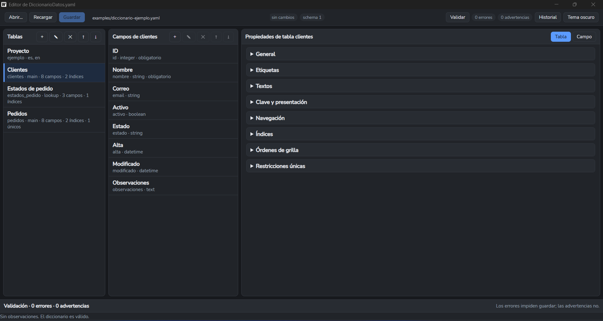

# Diccionario

Un archivo declara cómo son los datos de un proyecto. Esta aplicación lo edita, y esta
especificación dice cómo se escribe.

`DiccionarioDatos.yaml` es un archivo de texto que define, en un solo lugar, las tablas,
los campos, sus tipos, longitudes, relaciones, claves, validaciones, etiquetas en varios
idiomas y la metadata de cómo se muestra cada dato en formularios y grillas.

**Ese archivo es la fuente de verdad del modelo de datos del proyecto.** Ni las personas
ni los asistentes de IA tienen que volver a inventarlo: lo leen, lo respetan y, si hay que
cambiarlo, lo cambian primero ahí.

## Descargar

### ⬇ [Aplicación para Windows (64 bits, ~12 MB)](../../releases)

El ejecutable está en la sección **Releases** de este repositorio, dentro de **Assets** (el
archivo se llama `Diccionario-0.1.0-windows-amd64.exe`). No requiere instalación ni permisos
de administrador: se descarga y se ejecuta.

> **Windows va a avisar que es de un "editor desconocido"**, porque el binario no está
> firmado digitalmente. Elegí **Más información → Ejecutar de todas formas**. No es un error
> ni un virus: es el aviso estándar para cualquier programa sin firma comercial.

Para probar la aplicación **no hace falta compilar nada ni clonar el repositorio**. Si
querés trabajar sobre el código, mirá [Compilar desde el código](#compilar-desde-el-código).



*El editor con el diccionario de ejemplo: a la izquierda las tablas, en el medio los campos
de la tabla elegida y a la derecha las propiedades del elemento seleccionado.*

## El problema que resuelve

Cuando el modelo de datos no está declarado en ningún lado, cada pantalla lo resuelve como
puede. Aparecen los síntomas conocidos: campos y columnas dimensionados por el espacio
disponible en lugar de por el dato, encabezados desalineados con las filas, validaciones
inconsistentes y la misma decisión tomada de tres maneras distintas.

Se agrava cuando participan varios asistentes de IA: uno diseña, otro programa, y cada uno
improvisa su propia versión. Con un contrato explícito y compartido, los dos trabajan sobre
lo mismo.

## Qué contiene este repositorio

| Ruta | Qué es |
| --- | --- |
| `skill/` | La especificación canónica del formato, las reglas de uso y la guía de puesta en marcha en un proyecto. |
| `examples/` | Un diccionario de ejemplo (clientes, estados de pedido y pedidos) para probar la aplicación sin tener uno propio. |
| `internal/core/` | El núcleo en Go: modelo, validación, persistencia, historial, bloqueo y diff. |
| `frontend/` | La interfaz en React + TypeScript. |
| `build/`, `wails.json` | Configuración de compilación del escritorio (Wails). |

La aplicación es **opcional**: el contrato vive en el archivo. El editor existe para
trabajarlo con comodidad y sin romperlo.

## Los dos modos de trabajo

El sistema está definido por **roles**, no por productos: sirve cualquier asistente de diseño y
cualquier agente de programación.

- **Modo Diseñador** — el asistente que convierte necesidades funcionales en tablas, campos,
  tipos, relaciones y presentación. Su referencia es la especificación, y las decisiones tienen
  que quedar escritas en el diccionario.
- **Modo Implementador** — el agente que consume el contrato para escribir el código: lee el
  diccionario antes de tocar estructuras de datos, usa la definición física del motor activo y
  no inventa nombres, tipos ni presentación que ya estén definidos.

El detalle de cada rol, el protocolo de edición completo y los mensajes para pasarle a cada uno
están en [`skill/PUESTA_EN_MARCHA.md`](skill/PUESTA_EN_MARCHA.md),
[`skill/SKILL.md`](skill/SKILL.md) y [`skill/USO_EN_PROYECTOS.md`](skill/USO_EN_PROYECTOS.md).

## Dónde vive el archivo maestro

El diccionario **no se guarda dentro del repositorio del proyecto**. Vive en una carpeta
compartida a la que puedan llegar los tres actores que participan:

- **la persona** que decide y revisa, trabajando con el editor;
- **ChatGPT web**, en Modo Diseñador, que propone y ajusta el modelo;
- **Codex** (o el asistente local equivalente), en Modo Implementador, que consume el
  contrato para escribir el código.

En el flujo actual esa carpeta es una **carpeta de Google Drive sincronizada localmente**:

```text
<Carpeta compartida>/AI-Proyectos/<Proyecto>/
    DiccionarioDatos.yaml
    DiccionarioDatos.lock      (existe sólo durante una sesión de escritura)
    historial/
```

**¿Por qué una carpeta compartida y no el repositorio?** Porque ChatGPT web no puede ver
el disco del equipo, el asistente local trabaja sobre la copia sincronizada y el editor
abre ese mismo archivo. Google Drive es el punto de encuentro común: es **solo transporte**,
no forma parte del contrato y no cambia el formato del archivo.

No hay una ruta predeterminada universal: la ubicación concreta de cada proyecto se
registra en `Docs/DICCIONARIO.md` del proyecto consumidor. El detalle completo está en
[`skill/USO_EN_PROYECTOS.md`](skill/USO_EN_PROYECTOS.md), sección "Dónde vive el archivo
maestro".

## Puesta en marcha en un proyecto

Tres actores trabajan sobre el mismo archivo: **la persona** que decide, **un asistente de
diseño** y **un agente de programación**. El orden es este:

1. **Creá la carpeta compartida.** En Google Drive, una carpeta por proyecto
   (`AI-Proyectos/<Proyecto>`), e instalá **Google Drive para escritorio** para que quede
   sincronizada y disponible localmente. Ahí van a vivir el diccionario, su historial y su
   bloqueo. Sin este paso, ninguno de los otros dos actores puede llegar al archivo.
2. **Poné ahí el archivo maestro**, llamado `DiccionarioDatos.yaml`. Si empezás de cero, podés
   partir de [`examples/diccionario-ejemplo.yaml`](examples/diccionario-ejemplo.yaml).
3. **Registrá la ubicación** en `Docs/DICCIONARIO.md` del proyecto, para que ningún actor
   dependa de recordar una conversación anterior.
4. **Abrilo con el editor** y comprobá que valide sin errores.
5. **Habilitá al asistente de diseño** pegándole el mensaje de la guía (una vez por proyecto).
6. **Habilitá al agente de programación**: instalá la skill en tu agente y pegale su mensaje.

➡️ **Guía paso a paso, con los mensajes listos para copiar y pegar, la lista de verificación y
las precauciones de la carpeta sincronizada:
[`skill/PUESTA_EN_MARCHA.md`](skill/PUESTA_EN_MARCHA.md)**

**No es obligatorio usar ChatGPT ni Codex.** El sistema está definido por roles: sirve cualquier
asistente de diseño —cualquier conversacional con acceso al archivo— y cualquier agente de
programación —cualquier agente con acceso al código del proyecto—. Esos dos productos son los
ejemplos del flujo actual, nada más.

## Qué garantiza el editor al guardar

El archivo es la única fuente de verdad, así que la escritura está protegida:

- **Bloqueo cooperativo** (`DiccionarioDatos.lock`) para que dos actores no se pisen.
- **Hash base SHA-256**: si el archivo cambió por afuera mientras lo tenías abierto, el
  editor avisa y **no lo sobrescribe**.
- **Respaldo previo** en `historial/`, con el estado anterior y un resumen en Markdown de
  lo que cambió y por qué.
- **Guardado verificado**: escribe un temporal, lo relee, lo vuelve a validar y recién
  entonces reemplaza el maestro.
- **Validación estricta**: una propiedad desconocida es un error, no algo que se ignora en
  silencio.
- **Restauración** de cualquier versión del historial, validándola antes de aplicarla.

## Compilar desde el código

Requisitos: Go 1.25 o superior, Node.js y el CLI de Wails.

```powershell
go install github.com/wailsapp/wails/v2/cmd/wails@latest
npm install --prefix frontend
wails build          # deja el ejecutable en build\bin\
```

Pruebas:

```powershell
go test ./internal/...
npm run test --prefix frontend
```

La aplicación abre cualquier `DiccionarioDatos.yaml`: el de tus proyectos, o cualquiera que
escribas siguiendo la especificación. Si no tenés uno a mano, abrí
[`examples/diccionario-ejemplo.yaml`](examples/diccionario-ejemplo.yaml): es un contrato
válido, mínimo y genérico, pensado para recorrer la interfaz.

## Alcance del editor

Implementado: cabecera del proyecto, tablas y campos completos, tipos lógicos y definición
física por motor, relaciones, `allowed_values`, índices, restricciones únicas compuestas,
órdenes de grilla, `display_fields`, metadata de formulario y grilla, `lifecycle`,
deprecación, `auditable`, y la referencia de formatos temporales canónicos.

Deliberadamente **sin editor visual**: `format_version` (se informa en la barra superior y
no se cambia) y `schema_version` (se incrementa solo cuando el cambio es estructural o
semántico).

Pendiente: reordenar arrastrando y soltando; hoy se usan los botones subir y bajar.

## Estado del proyecto

**En desarrollo y prueba.** El contrato está en su versión estable (`skill 2.0.0`,
`format_version: 2`) y el editor funciona, pero el recorrido funcional completo todavía se
está validando con diccionarios reales. Es un buen momento para probarlo y reportar
problemas, no para confiar en él como herramienta de producción sin revisar los resultados.

## Licencia

Sin definir por ahora. Hasta que se declare una licencia, todos los derechos quedan
reservados al autor.
